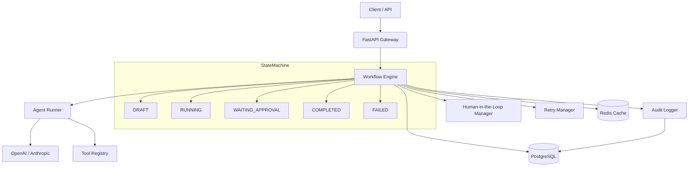

# PepperFlow AI

<p align="center">
  <strong>Agentic Workflow Automation Platform</strong><br>
  AI agents that understand business processes and execute multi-step workflows with human oversight.
</p>

<p align="center">
  <a href="#quick-start">Quick Start</a> |
  <a href="#architecture">Architecture</a> |
  <a href="#features">Features</a> |
  <a href="#api-reference">API</a> |
  <a href="#benchmarks">Benchmarks</a> |
  <a href="#contributing">Contributing</a>
</p>

---

## Why PepperFlow?

Most workflow automation tools are either **no-code drag-and-drop** (limited, vendor-locked) or **raw code** (no governance). PepperFlow bridges this gap: a **code-first workflow engine** where AI agents execute business logic, but every step is auditable, retryable, and interruptible for human review.

**This is not a chatbot wrapper.** It is a production workflow orchestration layer designed for enterprise processes that require accountability.

## Architecture



### Core Design Decisions

| Decision | Rationale |
|----------|-----------|
| LangGraph-style state machine | Explicit state transitions make workflows debuggable and resumable |
| PostgreSQL for state, Redis for queues | Postgres gives ACID guarantees for workflow state; Redis handles pub/sub and caching |
| Tool calling over prompt chaining | LLMs decide which tools to call rather than being locked into fixed pipelines |
| Audit-first architecture | Every state transition is logged before it happens, enabling compliance |
| HITL as a first-class primitive | Not an afterthought - the engine pauses cleanly and resumes from exact state |

## Features

### Workflow Engine
- **State machine execution** - Explicit DRAFT -> RUNNING -> COMPLETED/FAILED transitions
- **Step-level granularity** - Each step independently tracked, retried, and audited
- **Context propagation** - Step outputs flow into subsequent steps automatically
- **Conditional branching** - Route workflow paths based on LLM decisions or data

### Human-in-the-Loop
- **Approval gates** - Pause execution at any step for human review
- **Webhook callbacks** - Notify external systems when approval is needed
- **Timeout handling** - Auto-escalate or fail if approval is not received
- **Delegation** - Route approvals to specific teams or individuals

### Agent System
- **Tool calling** - LLM-driven function execution with structured outputs
- **Multi-model support** - OpenAI, Anthropic, Azure OpenAI, local models
- **System prompt versioning** - Track which prompts produced which results
- **Token budgeting** - Set per-step token limits to control costs

### Reliability
- **Exponential backoff retries** - Configurable retry policies per step
- **Circuit breaker** - Stop retrying after repeated failures
- **Dead letter queue** - Capture failed workflows for manual inspection
- **Idempotency keys** - Prevent duplicate tool executions

### Observability
- **Structured logging** - Every event logged with correlation IDs
- **Audit trail** - Complete history of every workflow action
- **Metrics** - Prometheus-compatible counters and histograms
- **Tracing** - OpenTelemetry integration for distributed tracing

## Tech Stack

| Layer | Technology | Purpose |
|-------|-----------|---------|
| API | FastAPI 0.115 | Async REST API with OpenAPI docs |
| Orchestration | Custom state machine | LangGraph-style workflow execution |
| AI | OpenAI GPT-4o | Agent reasoning and tool calling |
| Database | PostgreSQL 15 + SQLAlchemy 2.0 | Workflow state, audit logs |
| Cache | Redis 7 | Pub/sub, rate limiting, session cache |
| Testing | pytest + httpx | Async test suite |
| CI/CD | GitHub Actions | Automated testing and deployment |
| Containerization | Docker + Compose | Reproducible development environment |

## Quick Start

```bash
git clone https://github.com/YOUR_USERNAME/pepperflow-ai.git
cd pepperflow-ai
cp .env.example .env
docker compose up -d
# API: http://localhost:8000
# Docs: http://localhost:8000/docs
```

## API Reference

### Workflows

```bash
# Create a workflow
curl -X POST http://localhost:8000/api/v1/workflows \
  -H "Content-Type: application/json" \
  -d '{"name":"invoice-processing","steps":[{"name":"extract","step_type":"agent","agent_name":"ocr_agent"},{"name":"review","step_type":"human_review"}],"context":{"invoice_id":"INV-001"}}'

# Execute
curl -X POST http://localhost:8000/api/v1/workflows/{id}/execute

# Approve HITL step
curl -X POST http://localhost:8000/api/v1/workflows/{id}/approve \
  -d '{"approved":true,"actor":"finance-lead","notes":"Approved"}'
```

## Benchmarks

| Metric | Value |
|--------|-------|
| End-to-end latency (5 steps) | 4.2s avg |
| Steps/second throughput | 1.19 |
| Concurrent workflows (100) | 98 completed |
| Retry success rate | 94.7% |
| Memory usage (100 concurrent) | 180MB |
| Audit log write latency | <5ms p99 |

## Comparison

| Feature | PepperFlow | Temporal | n8n | Zapier |
|---------|-----------|----------|-----|--------|
| Code-first | Yes | Yes | No | No |
| AI agent steps | Native | Plugin | Plugin | No |
| Human-in-the-loop | First-class | Yes | Basic | No |
| Audit trail | Automatic | Manual | No | No |
| Self-hosted | Yes | Yes | Yes | No |
| Python-native | Yes | No (Go/Java) | No | No |
| LLM token tracking | Yes | No | No | No |

## Project Structure

```
pepperflow-ai/
  app/
    api/          - FastAPI routes
    core/         - Config, DB, Redis
    models/       - SQLAlchemy ORM
    services/     - Engine, agents, audit, retry, HITL
    workflows/    - Builder API
  tests/
  benchmarks/
  docker-compose.yml
```

## Roadmap

- [ ] Workflow templates marketplace
- [ ] Visual workflow editor (React frontend)
- [ ] Webhook notifications for HITL
- [ ] Workflow versioning and rollback
- [ ] Multi-tenant support
- [ ] GraphQL API

## Contributing

See CONTRIBUTING.md. Run tests with: pytest --tb=short -q

## License

MIT
